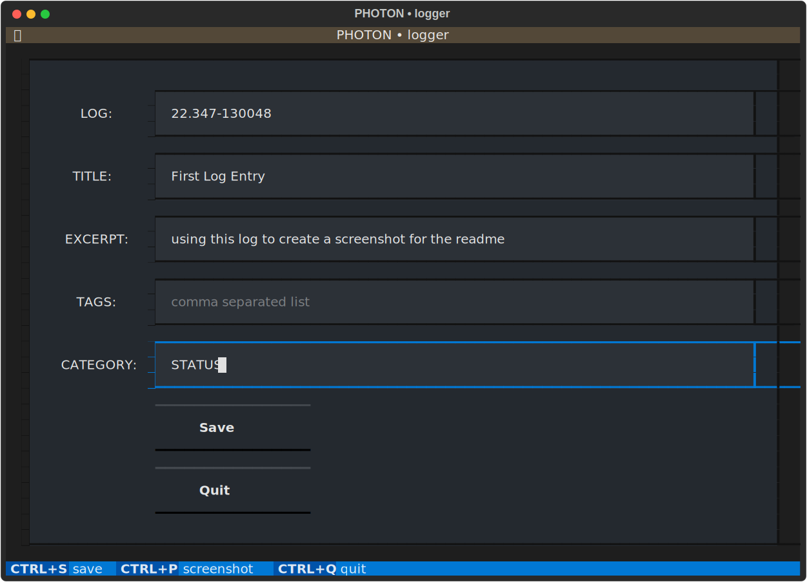

The **PHOTON platform • logger** is a simple app to create log entries in the
reST format, specifically for the ABlog utility for Sphinx.

The app is built in Python using the new Textual_ UI library.

.. _Textual: https://github.com/Textualize/textual
